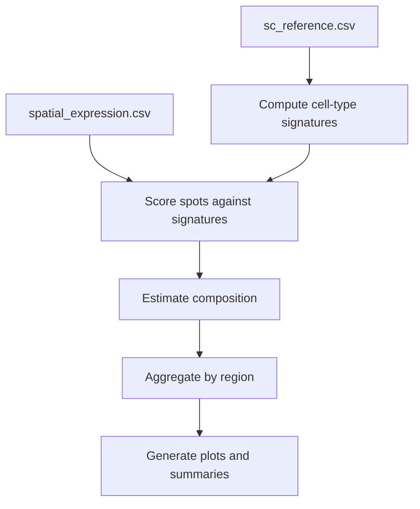
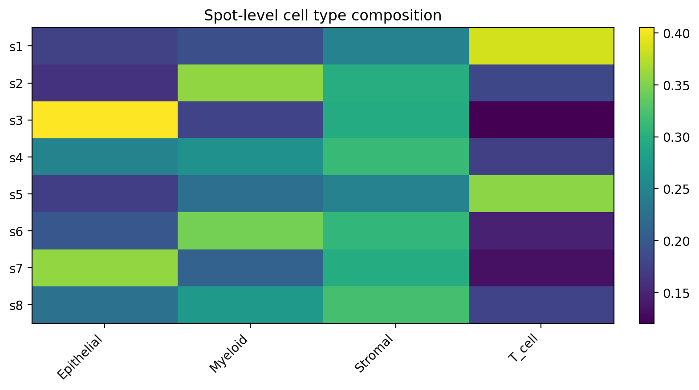
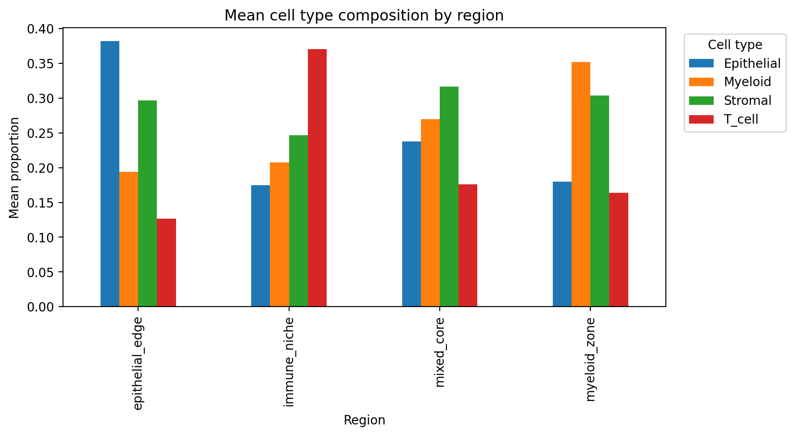

# single-cell-spatial-analysis

A notebook-based downstream analysis project for integrating mock single-cell and spatial transcriptomics data, deriving reference signatures, estimating spot-level cell-type composition, and generating region-level summaries.

## Overview

This project demonstrates a lightweight, reproducible analysis pipeline inspired by common workflows in single-cell and spatial transcriptomics.

It focuses on:

- deriving reference expression signatures from single-cell data  
- mapping spatial spots to reference cell types  
- estimating cell-type composition per spatial location  
- aggregating results into region-level summaries for interpretation  

The implementation is intentionally simplified and transparent, while conceptually reflecting analysis patterns used in tools such as Scanpy and cell2location.

## Workflow

## Notebooks

The analysis is structured into three notebooks:

1. Reference QC and signatures

`notebooks/01_reference_qc_and_signatures.ipynb`

- inspects mock single-cell reference data
- computes average expression signatures per cell type

2. Spatial scoring and composition

`notebooks/02_spatial_scoring_and_composition.ipynb`

- scores spatial spots against reference signatures
- converts similarity scores into relative composition estimates

3. Region summary and interpretation

`notebooks/03_region_summary_and_report.ipynb`

- integrates spatial metadata
- aggregates composition by region
- generates interpretable plots and summaries

## Inputs

Located in `data/raw/`:

- `sc_reference.csv`
- `spatial_expression.csv`
- `spatial_metadata.csv`

## Outputs

Saved to `data/output/` and `figures/`:

- `celltype_signatures.csv`
- `spot_celltype_scores.csv`
- `spot_celltype_composition.csv`
- `region_summary.csv`
- `celltype_composition_heatmap.png`
- `region_celltype_barplot.png`

## Visual outputs

### Spot-level composition

### Region-level summary

## Report preview

The workflow produces interpretable summaries of spatial organisation.

## Method summary

- cell-type signatures are computed as mean expression per gene per cell type
- spatial spots are scored using cosine similarity against signatures
- scores are normalised to estimate relative composition
- region-level summaries are computed via aggregation

This provides a simplified but interpretable approximation of reference-based spatial mapping.

## Why notebooks

This project is notebook-led to reflect the exploratory and interpretive nature of downstream transcriptomics analysis, while still using modular Python functions (src/) for clarity and reuse.

## Future improvements

- incorporate clustering or dimensionality reduction
- extend to multimodal mock data
- generate HTML reports
- add lightweight pipeline automation